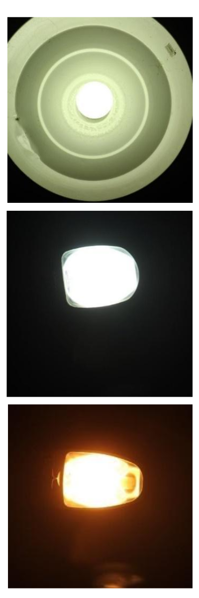

# Streetlight Type and Wattage Classifier

This repository implements an end-to-end classifier for intelligent detection of street lighting lamp types and wattages using a visual pre-trained transformer. The model is trained on a dataset containing image descriptors obtained from experiments using traditional machine learning models.

## Features


- **Dataset Information:** Details about the dataset used for training the model, including image descriptors obtained from experiments using traditional machine learning models.

- **Visual Pre-trained Transformer:** The model leverages a visual pre-trained transformer for enhanced feature extraction and classification accuracy.

- **End-to-End Classification:** The repository provides a complete solution for classifying street lighting lamp types and estimating wattages.


### Dataset Information
The dataset utilized in this work comprises planar images of streetlight lamps with varying types and wattages. The distribution of the dataset consists of nine classes, as depicted in the table below:
| **Class (Lamp Type)** | **Instances** | **Distribution** |
|------------------------|---------------|-------------------|
| Sodium70W              | 30            | 10.10%            |
| Sodium100W             | 32            | 10.77%            |
| Sodium150W             | 35            | 11.78%            |
| Sodium250W             | 33            | 11.11%            |
| Sodium400W             | 37            | 12.46%            |
| Mercury125W            | 21            | 7.07%             |
| Metal150W              | 23            | 7.74%             |
| Metal250W              | 49            | 16.50%            |
| Metal400W              | 37            | 12.46%            |

The following showcases samples from the dataset:



*Figure 1: Samples of Images of the PL Dataset.*


### Visual Pre-Trained Transformer

We are using the Visual Transformer Neural Network (*ViT*) to learn and predict the lamp's type and wattage classes.

ViT is a type of neural network architecture designed for computer vision tasks. Unlike traditional convolutional neural networks (CNNs) that operate on local image patches, ViT applies a transformer architecture directly to the entire image. It divides the image into fixed-size patches, linearly embeds each patch, adds positional embeddings, and then processes the sequence of embeddings through transformer layers for image understanding and classification tasks. 

For more information on ViT please refer to the published paper in arXiv: [An Image is Worth 16x16 Words: Transformers for Image Recognition at Scale](https://doi.org/10.48550/arXiv.2010.11929)


### End-to-End Classification

For a comprehensive understanding of the experimental methodology, refer to the [report](https://github.com/ivarejao/streetlight-type-wattage-detection/blob/main/Report-VitorBonella-IgorVarej%C3%A3o.pdf).

## How to run the report experiments

Follow these steps:

1. **Get Images from the Data Repository:**
   ```bash
   git clone https://github.com/NINFA-UFES/PublicLightDataset
   ```
   rename the folder Images to img. Certify the folder is in the same diretory than the code.ipynb

2. **Run Notebook:**

   Run the notebook cells. Certify to install all requirements.


## Results

The model achieved promising results in terms of accuracy.
| **Feature Set**             | **Mean** | **Std** | **Lower Bound**  | **Upper Bound** |
|-----------------------------|----------|---------|------------------|------------------|
| **ViT Partial Fine Tunning**| **0.85** | **0.06**| **0.83**         | **0.87**         |
| ViT Feature Extractor       | 0.83     | 0.06    | 0.81             | 0.86             |

## Contributing

Contributions are welcome! Feel free to open issues or submit pull requests for any improvements or bug fixes.

## Experiments Video

The experiments explanation is available on https://youtu.be/JN8hdmprOwU

## License

This project is licensed under the [MIT License](LICENSE).
